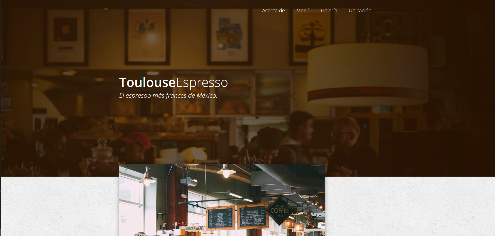

# Cafe-Toulouse
Este proyecto consiste en el diseño y desarrollo de una cafetería en línea desde cero, utilizando herramientas de UI/UX como Figma, así como lenguajes de programación web como HTML, CSS y JavaScript.

**Visitar sitio:** https://ferelias.github.io/Cafe-Toulouse/